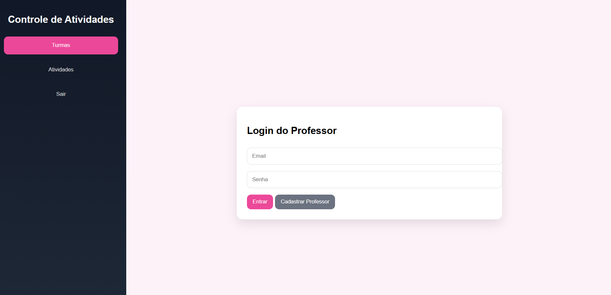
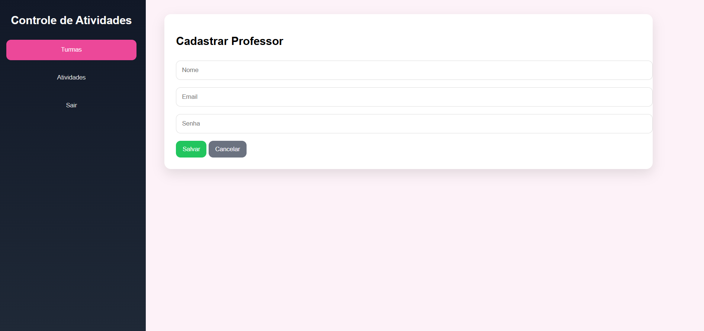
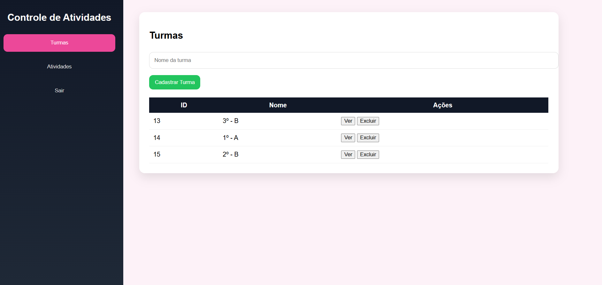
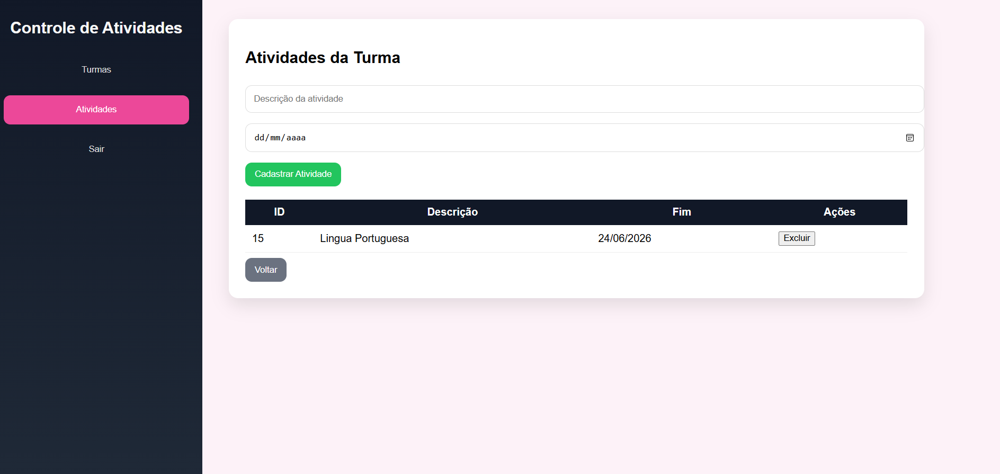

# Sistema de Controle de Turmas e Atividades

Sistema web full-stack que permite ao professor se autenticar, visualizar, registrar e excluir turmas, além de registrar atividades para cada turma.

---

# Visual do site






## O professor pode:
- Realizar login com e-mail e senha  
- Visualizar suas turmas  
- Cadastrar novas turmas  
- Excluir turmas (somente se não houver atividades vinculadas)  
- Visualizar atividades de cada turma  
- Cadastrar novas atividades  

---

##  Telas do Sistema

- Tela de Login  
- Tela Principal (Turmas)  
- Tela de Atividades  


##  Tecnologias Utilizadas

| Categoria | Tecnologia | Versão |
|----------|------------|--------|
| IDE | Visual Studio Code | 1.100+ |
| Back-end | Node.js | 22.17.1 |
| Framework | Express.js | 5.1.0 |
| ORM | Prisma | 7.8.0 |
| Banco de Dados | MariaDB (XAMPP) | 10.4+ |
| Front-end | HTML5 | - |
| Front-end | CSS3 | - |
| Front-end | JavaScript (ES6) | - |

---

## Requisitos de infraestrutura

- **IDE utilizada:** Visual Studio Code
- **SGBD:** MySQL (ou MariaDB)
- **Servidor de aplicação:** Node.js
- **Back-end:** Express.js (ou similar)
- **Front-end:** HTML, CSS e JavaScript

---

## 🚀 Passo a Passo para Executar

### 1. Clonar o repositório
```bash
git clone 
cd escolaavaliacao

2. Iniciar o banco de dados
Abra o XAMPP e inicie o MySQL/MariaDB
Acesse: http://localhost/phpmyadmin
Crie o banco:

- Crie um arquivo `.env` na raiz do projeto:

```env
PORT=3000
DATABASE_URL="mysql://root@localhost:3306/mydb"
```

- Executar as migrations do banco de dados

```bash
npx prisma migrate dev
```

- Iniciar o servidor

```bash
npm run dev
```

O servidor estará disponível em `http://localhost:3000`.


## 4. 🚀 Executar o Front-end

- Abra a pasta `web/` no Visual Studio Code  
- Clique com o botão direito no arquivo `login/index.html`  
- Selecione **"Open with Live Server"**  

O sistema abrirá no navegador em:
http://127.0.0.1:5500